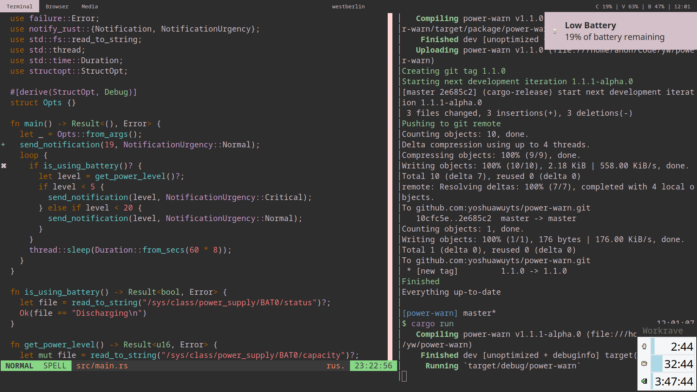

# power-warn
[![crates.io version][1]][2] [![build status][3]][4]
[![downloads][5]][6] [![docs.rs docs][7]][8]

Send notifications when your computer is running low on power.

- [Documentation][8]
- [Crates.io][2]

## Screenshot


## Usage
```txt
power-warn 1.0.0
Yoshua Wuyts <yoshuawuyts@gmail.com>
Warn on low power level

USAGE:
    power-warn

FLAGS:
    -h, --help       Prints help information
    -V, --version    Prints version information
```

## License
[MIT](./LICENSE-MIT) OR [Apache-2.0](./LICENSE-APACHE)

[1]: https://img.shields.io/crates/v/power-warn.svg?style=flat-square
[2]: https://crates.io/crates/power-warn
[3]: https://img.shields.io/travis/yoshuawuyts/power-warn.svg?style=flat-square
[4]: https://travis-ci.org/yoshuawuyts/power-warn
[5]: https://img.shields.io/crates/d/power-warn.svg?style=flat-square
[6]: https://crates.io/crates/power-warn
[7]: https://docs.rs/power-warn/badge.svg
[8]: https://docs.rs/power-warn
